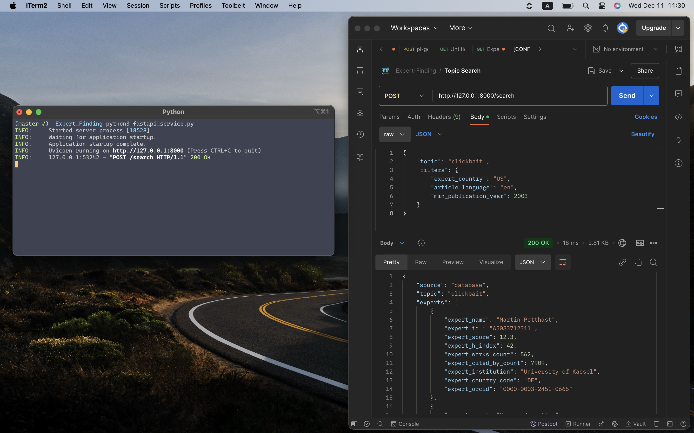
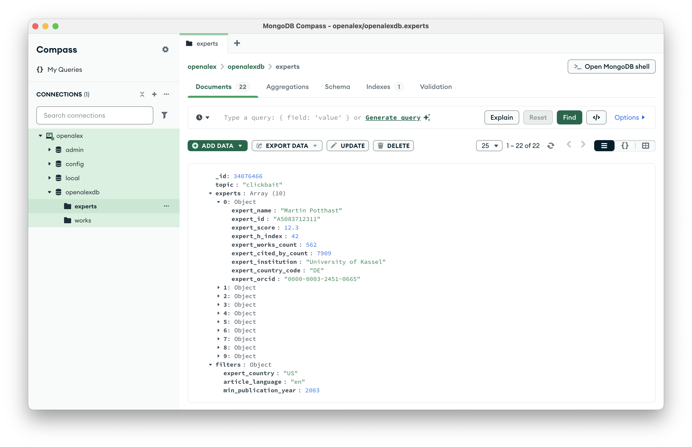

# Expert Finding

This project uses the OpenAlex API to identify experts on specified topics. Advanced filtering mechanisms are implemented to decide expertise, and FastAPI is used to provide API endpoints for user interaction.

I've used MongoDB as a NoSQL database for this project.

## Features
- Integration with OpenAlex API to gather expert data.
- Advanced filters for determining expertise.
- API endpoints built using FastAPI.
- Used MongoDB as an NoSQL database.

## Images




## Setup and Usage
1. Clone the repository.
2. Run the FastAPI server using `python3 fastapi_service.py`.
3. Use the API to query experts by specified topics.

## Requests Structs:

Type: POST

URL: `http://127.0.0.1:8000/search`

Body:

```json
{
    "topic": "clickbait",
    "filters": {
        "expert_country": "US",
        "article_language": "en",
        "min_publication_year": 2003
    }
}
```

Return:

```json
{
    "source": "database",
    "topic": "clickbait",
    "experts": [
        {
            "expert_name": "Martin Potthast",
            "expert_id": "A5083712311",
            "expert_score": 12.3,
            "expert_h_index": 42,
            "expert_works_count": 562,
            "expert_cited_by_count": 7909,
            "expert_institution": "University of Kassel",
            "expert_country_code": "DE",
            "expert_orcid": "0000-0003-2451-0665"
        },
        {
            "expert_name": "Savvas Zannettou",
            "expert_id": "A5007187227",
            "expert_score": 4.1,
            "expert_h_index": 32,
            "expert_works_count": 177,
            "expert_cited_by_count": 4026,
            "expert_institution": "Delft University of Technology",
            "expert_country_code": "CY",
            "expert_orcid": "0000-0001-5711-1404"
        },
        {
            "expert_name": "Logan Molyneux",
            "expert_id": "A5033766214",
            "expert_score": 3.0,
            "expert_h_index": 20,
            "expert_works_count": 59,
            "expert_cited_by_count": 2641,
            "expert_institution": "Temple University",
            "expert_country_code": "US",
            "expert_orcid": "0000-0001-7382-3065"
        },
        {
            "expert_name": "Abhijnan Chakraborty",
            "expert_id": "A5040381142",
            "expert_score": 2.9,
            "expert_h_index": 21,
            "expert_works_count": 127,
            "expert_cited_by_count": 2036,
            "expert_institution": "Indian Institute of Technology Kharagpur",
            "expert_country_code": "IN",
            "expert_orcid": "0000-0003-0908-1639"
        },
        {
            "expert_name": "Kevin Munger",
            "expert_id": "A5015770363",
            "expert_score": 2.2,
            "expert_h_index": 18,
            "expert_works_count": 210,
            "expert_cited_by_count": 1626,
            "expert_institution": "European University Institute",
            "expert_country_code": null,
            "expert_orcid": "0000-0002-4399-5250"
        },
        {
            "expert_name": "Yingdan Lu",
            "expert_id": "A5032446414",
            "expert_score": 2.1,
            "expert_h_index": 8,
            "expert_works_count": 38,
            "expert_cited_by_count": 379,
            "expert_institution": "Northwestern University",
            "expert_country_code": "US",
            "expert_orcid": "0000-0002-9955-6070"
        },
        {
            "expert_name": "Peter Bourgonje",
            "expert_id": "A5016174489",
            "expert_score": 1.3,
            "expert_h_index": 13,
            "expert_works_count": 51,
            "expert_cited_by_count": 537,
            "expert_institution": "University of Potsdam",
            "expert_country_code": "DE",
            "expert_orcid": "0000-0001-7382-3065"
        },
        {
            "expert_name": "Md Main Uddin Rony",
            "expert_id": "A5058589447",
            "expert_score": 1.2,
            "expert_h_index": 6,
            "expert_works_count": 10,
            "expert_cited_by_count": 186,
            "expert_institution": "University of Maryland, College Park",
            "expert_country_code": "US",
            "expert_orcid": "0000-0002-0749-8767"
        },
        {
            "expert_name": "Amol Agrawal",
            "expert_id": "A5032693382",
            "expert_score": 1.0,
            "expert_h_index": 4,
            "expert_works_count": 7,
            "expert_cited_by_count": 124,
            "expert_institution": "University of Massachusetts Amherst",
            "expert_country_code": "IN",
            "expert_orcid": "0000-0003-2451-0665"
        },
        {
            "expert_name": "Prakhar Biyani",
            "expert_id": "A5057030973",
            "expert_score": 1.0,
            "expert_h_index": 11,
            "expert_works_count": 17,
            "expert_cited_by_count": 574,
            "expert_institution": "Yahoo (United States)",
            "expert_country_code": "US",
            "expert_orcid": "0000-0003-2451-0665"
        }
    ],
    "elapsed_time": "0.01 seconds"
}
```

<br>

Type: GET

URL: `http://127.0.0.1:8000/expert/<EXPERT-ID>`

Return:

```json
{
    "source": "api",
    "author": {
        "author_name": "Arzu Çoban",
        "author_id": "A5091338950",
        "author_h_index": 11,
        "author_works_count": 48,
        "author_cited_by_count": 528,
        "author_institution": "Istanbul University",
        "author_topics": [
            "Multiple Sclerosis Research Studies",
            "Autoimmune Neurological Disorders and Treatments",
            "Peripheral Neuropathies and Disorders",
            "Systemic Lupus Erythematosus Research",
            "Migraine and Headache Studies",
            "Botulinum Toxin and Related Neurological Disorders",
            "Neurological disorders and treatments",
            "Genetic Neurodegenerative Diseases",
            "Parkinson's Disease Mechanisms and Treatments",
            "Ophthalmology and Eye Disorders",
            "Neurogenesis and neuroplasticity mechanisms",
            "Polyomavirus and related diseases",
            "MicroRNA in disease regulation",
            "Ocular Diseases and Behçet’s Syndrome",
            "Sleep and Wakefulness Research",
            "Cytokine Signaling Pathways and Interactions",
            "Sympathectomy and Hyperhidrosis Treatments",
            "Trigeminal Neuralgia and Treatments",
            "Inflammasome and immune disorders",
            "Infectious Encephalopathies and Encephalitis",
            "Intracerebral and Subarachnoid Hemorrhage Research",
            "Ion channel regulation and function",
            "Genetics and Neurodevelopmental Disorders",
            "Facial Rejuvenation and Surgery Techniques",
            "Intracranial Aneurysms: Treatment and Complications"
        ],
        "author_orcid": "https://orcid.org/0000-0002-7139-9923"
    }
}
```


## License

This project is licensed under the [MIT License](LICENSE).